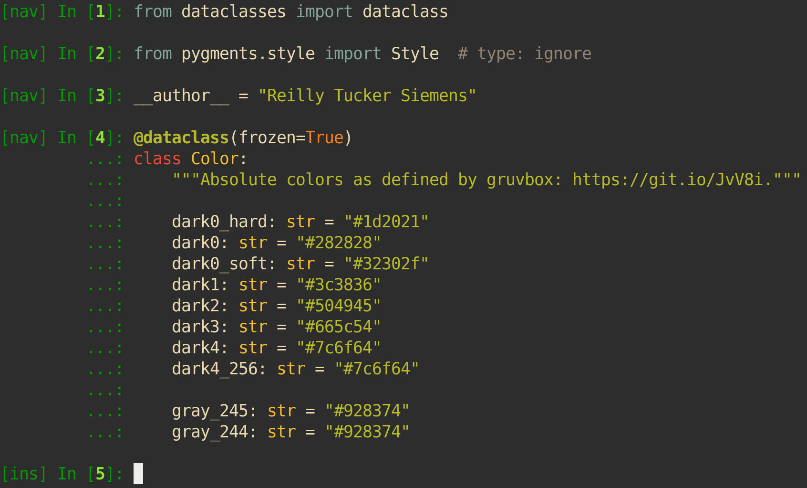

IPython Style Gruvbox
=====================

.. image:: https://img.shields.io/github/workflow/status/reillysiemens/ipython-style-gruvbox/Test/master.svg?style=flat-square&label=tests
    :target: https://github.com/reillysiemens/ipython-style-gruvbox/actions?query=workflow%3ATest
    :alt: GitHub Actions test status

.. image:: https://img.shields.io/coveralls/github/reillysiemens/ipython-style-gruvbox/master?style=flat-square
    :target: https://coveralls.io/github/reillysiemens/ipython-style-gruvbox
    :alt: Coveralls code coverage

.. image:: https://img.shields.io/badge/license-ISC-purple?style=flat-square
    :target: https://github.com/reillysiemens/ipython-style-gruvbox/blob/master/LICENSE
    :alt: License

.. image:: https://img.shields.io/github/v/release/reillysiemens/ipython-style-gruvbox?style=flat-square
    :target: https://github.com/reillysiemens/ipython-style-gruvbox/releases/latest
    :alt: Latest release

.. image:: https://img.shields.io/badge/code%20style-black-black?style=flat-square
    :target: https://github.com/psf/black
    :alt: Any color you like

An opinionated terminal colorscheme for IPython using `gruvbox`_ colors.

Installation
------------

The ``ipython-style-gruvbox`` package is not currently published to `PyPI`_
because of its highly opinionated, personal nature. If, however, you still
wish to install this package, the following steps *should* work to install the
`latest release`_.

.. code-block:: bash

    repo='https://github.com/reillysiemens/ipython-style-gruvbox'

    # Find the latest release.
    latest=$(git ls-remote --tags --refs $repo | # Fetch remote tags.
                     sort -t '/' -k 3 -V |       # Sort them by version.
                     tail -n 1 |                 # Take the latest one.
                     awk -F / '{print $3}')      # Return only the tag.

    # Craft the URL for the release asset.
    version=$(echo $latest | tr -d 'v')  # Remove the leading v.
    wheel="ipython_style_gruvbox-${version}-py3-none-any.whl"
    release="${repo}/releases/download/${latest}/${wheel}"

    # Install the release.
    pip install $release

Usage
-----

The style installs itself as a `Pygments plugin`_, so after
installation you should only need to launch IPython with the ``gruvbox`` style

.. code-block:: bash

   ipython --TerminalInteractiveShell.highlighting_style=gruvbox

or add it to your `IPython config`_.

.. code-block:: python

   config = get_config()
   config.TerminalInteractiveShell.highlighting_style = "gruvbox"

*Note:* This will only affect your syntax highlighting. If you're looking to
create a prompt that looks exactly like the one in the image above this
`example prompt`_ might help.

.. _gruvbox: https://github.com/morhetz/gruvbox
.. _PyPI: https://pypi.org/
.. _latest release: https://github.com/reillysiemens/ipython-style-gruvbox/releases/latest
.. _Pygments plugin: https://pygments.org/docs/plugins/#entrypoints
.. _IPython config: https://ipython.readthedocs.io/en/stable/config/intro.html
.. _example prompt: https://github.com/reillysiemens/dotfiles/blob/8994f69f23271aa93d83e81032542f17b38423fd/.ipython/profile_default/ipython_config.py
